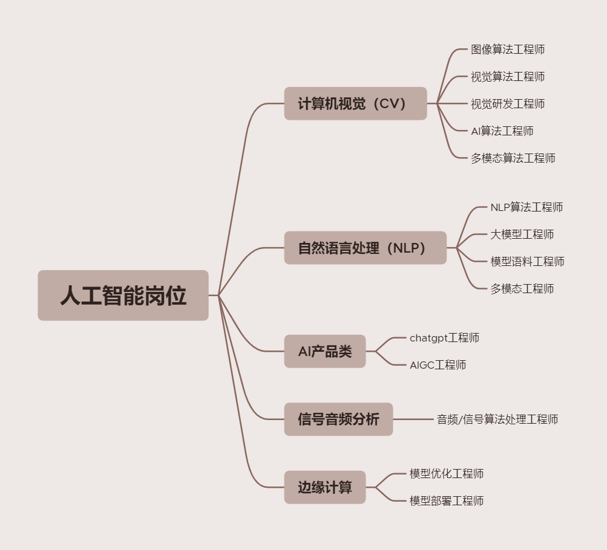
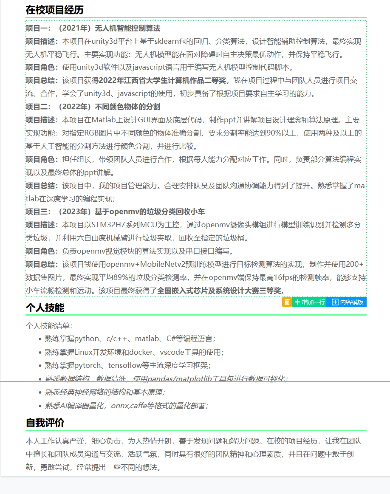

# 智科专业（本科）如何就业？

## 总体概况

人工智能（智科）本科**就业率不理想**，大部分人最终的去向都是**读研读博**，就业的偏少。

人工智能大方向是**计算机方向**，想要本科就业的话，可参考计算机专业的路子，刷**力扣**，多做点**工程项目或实习**。

## 专业方向

人工智能专业涵盖较广，可细分为：

- 机器学习(偏理论)
- CV
- NLP
- 语音识别
- ……

根据杭电本科培养方案，包括如**CV, NLP等热门方向**，但不会特别前沿，也不会很深入。

**深耕某一个领域，才可能有所建树。**

## 人工智能相关岗位

### 相关岗位及需求企业较少！

千万别信什么“人才需求大”“就业轻松”！！！

### 人工智能岗位门槛高！

请你以HR的角度思考，同样的薪资，在研究生和本科生之间选，选谁？就算是研究生，选仅学过一点点课内皮毛的？还是选有丰富经验且发表多篇SCI的？

就目前就业环境来说，基本都要求：

> 硕/博毕业，发表国际顶刊论文，有多年Linux下C++/Python开发经验……

### 打破幻想！

打开某招聘网站，看到一个“AI数据标注工程师”。哇~听起来好厉害！哇~本科生也可以进！！

HR：“嘻嘻，又抓来一个**嗨奴**~”

## 急！学什么能救智科小灯于水深火热之中？

首先，企业要选你，当然是从简历开始。

可以参考该专业前辈的简历，这是一份来自知乎的参考：

### A. 项目经历

最好是参加过的**竞赛** ！！和导师做的项目也可以，**岗位契合度**要有体现。

现在看到这的你，

大一/大二？加油，早日规划，完全来得及！

大三了？之前干什么去了？还不快补！

大四了？……考研再为大学时光充值三年吧（？）

### B. 个人技能

大一、大二、大三，**好好利用课余时间（甚至课上时间），学一点有用的东西**。

别惦记你那啥信分什么自控了，咱喵一天到晚看控制看不出花活的。

但……我想“好好努力考出好成绩”？  嘻嘻，你开心就好~

> 你这个人，满脑子只想着自己呢。  ——丰川祥子
>
> 

## 参考资料：

[1] 知乎, 《本科人工智能（智科）这个路该怎么走？》, https://www.zhihu.com/question/636210858/answer/3335703361.

[2] 知乎, 《我的人工智能专业之路（一）就业篇》, https://zhuanlan.zhihu.com/p/664834747.
