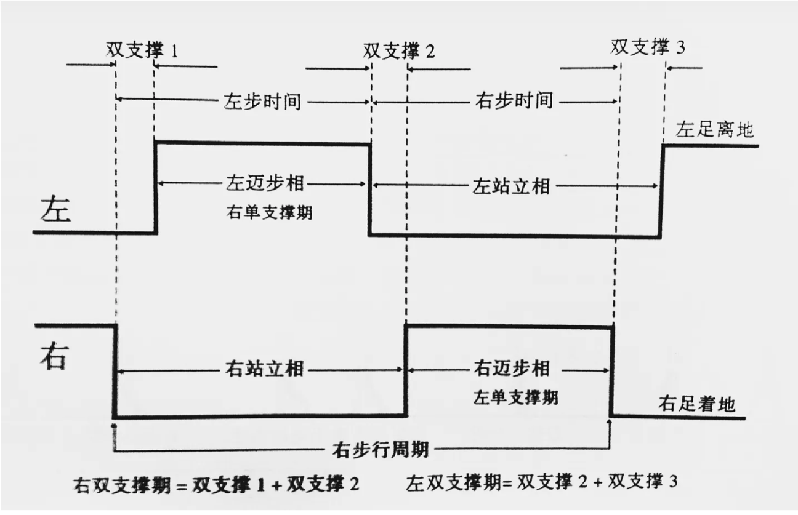
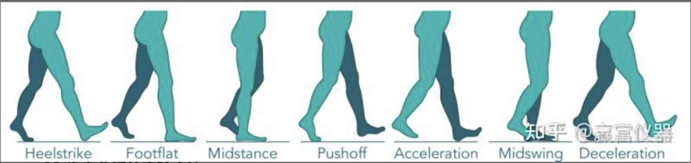
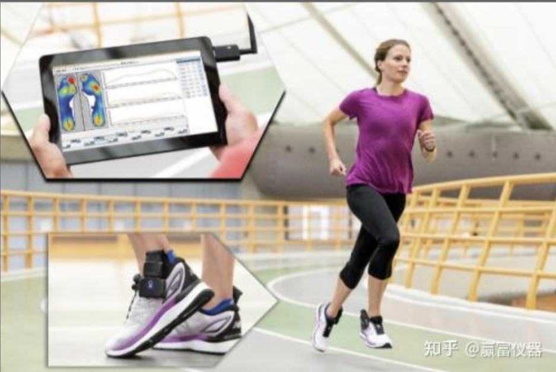
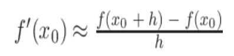
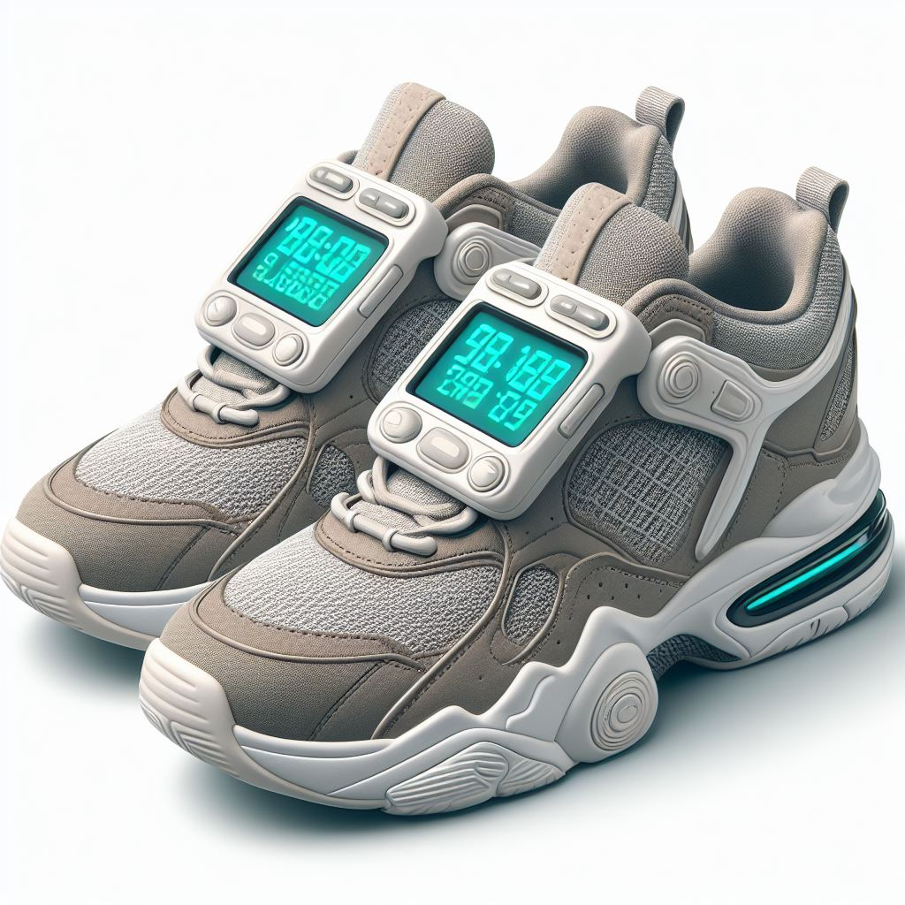
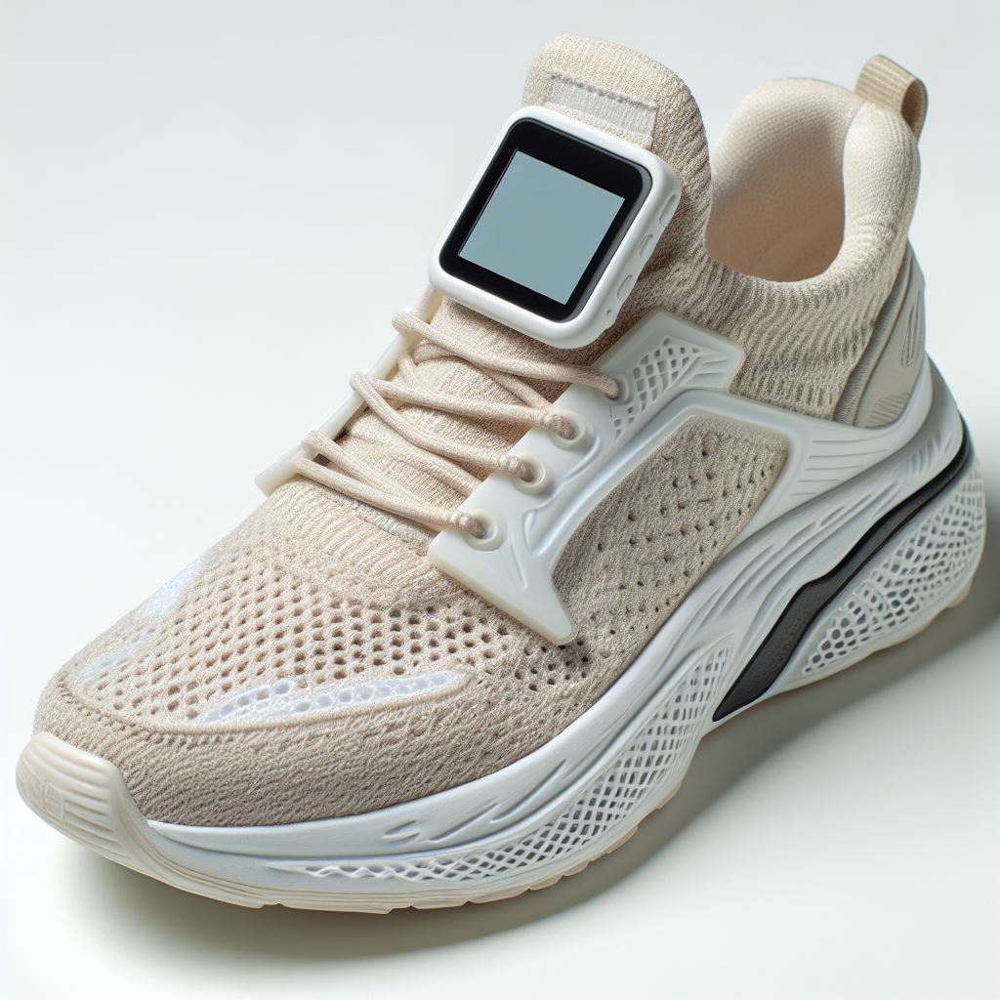
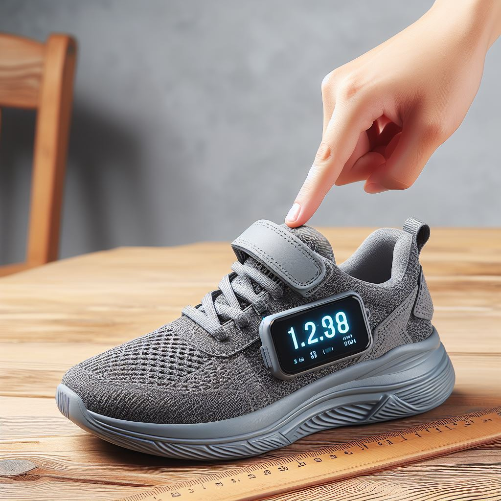

# 基于步态分析的智能鞋

## 一、问题产生的背景

### 1、*健康与康复市场*：

随着人们健康意识的提升，对于健康监测和康复辅助的需求不断增加。步态分析作为一种非侵入式的监测手段，在康复和健康管理领域有很大的应用潜力。

### 2、***运动与健身市场：***

现代社会对于运动与健身的重视程度也在不断提升，步态分析可以为运动员、健身爱好者等提供个性化的运动指导和优化建议，满足他们对于效率和成果的需求。

### 3、***智能科技发展***：

随着人工智能、物联网和智能穿戴设备等技术的发展，智能机器人和智能化产品的需求也在增加，步态分析作为智能机器人的一项核心功能，具有较大的市场空间。

### 4、***安全与监控领域***：

在安全监控和身份验证领域，步态分析可以提供一种新颖的识别手段，应用于安全门禁、身份验证等场景，满足安全领域对于高效、准确识别手段的需求。

## PS：这里加入步态分析的概念

### 01 步态分析的主要内容：

**步态周期分析**：

美国加州RLA国家康复中心的perry医生按照步行周期的发生顺序提出了RLA分类方法，即将站立相分解为5个时期，步行相分解为3个时期。

##### 1、首次着地

步行周期和站立周期的起始点，指足跟或者足底的其他部位首次与地面接触的瞬间。

##### 2、负荷反应期

指足跟着地后至足底与地面完全接触的一段时间。即一侧足跟着地后至另一侧下肢足底离地时，为双支撑期。

##### 3、站立中期

指从对侧下肢离地至身体躯干完全位于支撑腿的正上方时，为单腿支撑期。

##### 4、站立末期

指从支撑腿足跟离开地面至对侧下肢足跟着地的时期，为单腿支撑期。

##### 5、迈步前期

指从对侧下肢足跟着地到支撑脚离开地面之前的一段时间，是第二个双支撑相。

##### 6、迈步初期

指支撑脚离开地面至该腿膝关节最大屈曲程度（60度）。此阶段主要目的是使足底离开地面（成为足廓清），以确保下肢在向前摆动的时候不为地面所绊倒。

##### 7、迈步中期

指支撑腿的膝关节从最大屈曲角度到小腿垂直于地面的。保持足和地面之间的距离仍然是这一时期最主要的目的。

##### 8、迈步末期

指与地面垂直的小腿向前摆动至该侧足跟再次着地之前。这个时期小腿调整足的位置，并为下一个步行周期做准备。

**步态动力学分析**：

步态动力学分析可以测量人体运动的力量和能量，包括行走时的步态稳定性、肌肉活动和关节运动的角度、速度和力量等参数。

**步态生物力学分析**

步态生物力学分析研究人体行走运动对人体组织和结构的影响，包括足底压力分布、骨骼负荷和肌肉力量等方面的测量。

步态模式识别**：步态模式识别可以根据人体行走运动的特征，区分不同的步态模式。这种分析可以应用于诊断和监测一些步态相关的疾病，如帕金森病和脑卒中等。

**步态控制机制研究**：

步态控制机制研究人体如何协调不同的身体部位，以保持平衡和稳定的行走状态。

### 02  对于本项目有关步态分析的实验方法

**足部压力分布测量系统**

足底压力对分析人体运动中的平衡及稳定性有着重要的意义，通过实验测得足底不同分区的压力、压强等参数，可以得到不同群体在不同工况下的运动变化情况，还能反映出不同足部结构。如扁平足、高足弓等对人体运动的影响。

加拿大的XSENSOR X4 足底压力测试系统是市场上技术领先的鞋垫式足底压力测试系统，简单易用， 采用了高分辨率和高精度的电容式传感器 ，兼具大量程、高精度和可靠性好等特点。

**仿真软件VISUAL3D**

Visual 3D是集成力传感器、测力平台和测力跑台于一体的建模软件包，支持同步模拟数据。支持生物力学计算以及诱发式加速度分析和功能性关节中心计算。综合全面的数据管理模式，可实现复杂的数据分析。研究结果生成全面的报告和图表，保存对数据所有处理步骤的历史记录。可以兼容大部分动作捕捉系统、测力台和肌电设备。

### 03  步态分析的应用领域

近年来，步态分析被广泛应用于医学、人机工程等领域的研究中，包括临床医疗诊断和康复训练，机器人、人工关节的设计及康复辅具的研发等。除此之外，在竞技体育训练、生物特征识别和提取等研究中也发挥了重要作用，随着步态分析的不断发展，相关成果的应用领域也在持续拓展中。

#### **医学诊断及康复领域的应用**

作为人体神经肌肉骨骼系统协调运动的外在表现，人体的步态特征是临床诊断中不可缺少的依据之一。近年来，与三维步态分析临床疗效的相关文献大量增加，这些研究成果有助于不断改进数据的全面性与可用性，促进了研究者对步态病理学和治疗的理解，也证明了步态分析在改变治疗决策、提高临床医生对病情的掌握程度和改善患者术后疗效方面的功效。

#### **人机工程领域的应用**

随着技术发展，步态分析研究与机器人学结合也愈加紧密，有关外骨骼下肢康复机器人的研究逐渐增加。双侧下肢的对称性与人机耦合性研究是当下的热点问题。外骨骼机器人作为一种可穿戴设备，对人机耦合性能有着极高的要求。这就需要机器人能够准确识别并跟随穿戴者完成一系列复杂动作。在外骨骼机器人的研发中，借助步态实验，开发者获得大量不同复杂环境条件下的人体步态数据，并以此作为机器人运动控制策略的制定依据。

#### **体育训练领域的应用**

在体育训练方面，步态分析有效地帮助教练员制定科学的训练计划，根据不同运动员的项目与技术特点，有针对性地帮助他们提高运动成绩，避免运动损伤。

##### 参考文献

*[1]古恩鹏, 刘爱峰, 金鸿宾, 等. 步态分析在临床骨科 与康复中的应用[J]. 中国中西医结合外科杂志, 2011, 17(3): 335-337.*
*[2]张静茹. 人类行走步态模型及特征提取方法研究[D]. 上海: 上海大学, 2007.*
*[3]CHEN Fang, CUI Xi-wen, ZHAO Zhe, et al. Gait Acquisition and Analysis System for Osteoarthritis Based on Hybrid Prediction Model[J]. Computerized Medical Imaging and Graphics, 2020, 85: 101782.*
*[4]SAVONNET L, DUPREY S, WANG X. Coupling rigid multi-body and deformable finite element human models for assessing seat discomfort[C]. Montreal: DHM. 2016.*

## 二、要解决的问题

### 1、**数据采集与处理**：

采集到的步态数据可能会有噪音和干扰，需要进行有效的数据处理和滤波，提取出有效的步态特征，同时要考虑数据的实时性和准确性。

- 数据提供

  - 步态采集系统由获取压力信号的足压采集模块以及获取关节坐标信号的Azure Kinect系统组成。基于开发工具平台软件Visual Studio 2017（微软，美国）开发上位机平台，保证足压采集模块与Azure Kinect系统获取的数据帧同步为30 帧/s。其中足压采集模块采用薄膜压力传感器（深圳博丰盛电子公司，中国）进行压力信号的采集。根据Hessert等的研究，足底压力可分为十个区域，其中脚跟受到的压力最大，其次是拇趾部分。

    传感器分布如[图1](https://www.ncbi.nlm.nih.gov/pmc/articles/PMC10162918/figure/Figure1/)所示，根据步态分割的需要以及人体足底区域压力分布，设计每只脚使用两个薄膜压力传感器以获取足压，其中薄膜压力传感器1位于拇趾（hallux，HA）部分，薄膜压力传感器2位于跟骨内侧（medial calcaneus，MC）和跟骨外侧（lateral calcaneus，LC）的中心位置。关节跟踪采用Azure Kinect系统完成。步态采集分析系统工作流程如[图2](https://www.ncbi.nlm.nih.gov/pmc/articles/PMC10162918/figure/Figure2/)所示。

    由于标记法精度较高，将其作为对照的测试系统（后文统称：摄像机系统），具体为采用两部采样频率为30 帧/s的摄像机（日本胜利公司，GZ-MG21U，日本）对受试者步态进行记录。两部摄像机分别放置于步道的两侧，并在人体重要关节安置关节标记点，同时在行走步道上放置步长标记块。将记录视频逐帧拆分后，对图像建立坐标系，获取各关节坐标，同时获取脚跟触地（foot touch，FT）、脚趾离地（toe off，TO）的关键帧，由此得到步行过程中的上下肢关节角度参数及步态时间参数。以地面划定的步长标记块作为步幅衡量标准，结合FT、TO关键帧，提取步态空间信息，最终提取行走过程的全部步态信息，以此作为试验的对照组进行分析。

    整体系统设计如[图3](https://www.ncbi.nlm.nih.gov/pmc/articles/PMC10162918/figure/Figure3/)所示，其中红色部分为本研究所用对照测试系统（摄像机系统），蓝色部分为本研究所设计的步态采集系统。

​					

​					图1

​					

​					图2

​					

​					图3

- 数据处理

  - 通常步态周期分为两个主要阶段，即支撑相和摆动相。行走过程中的具体步态分割以及两足足底压力变换区域如[图4](https://www.ncbi.nlm.nih.gov/pmc/articles/PMC10162918/figure/Figure4/)所示，其中足底黑色部分表示行走过程中足底受压区域。根据行走过程中足底压力的变化，确定FT和TO作为步态分割的事件。

    

    ​	图4

    - （1）FT：FT为判断步态周期起止的事件，通过对其判断可以获取步态周期参数。在FT发生的瞬间，脚跟压力会产生瞬变，因此对脚跟压力进行微分处理。根据离散型数据的特点，采取向前差商的方法对压力数据进行处理，以*f*(*x*0+*h*)作为当前值，以*f*(*x*0)作为前值，以*h*作为增量，得到数值微分结果

      

    - （2）TO：TO是步态周期中支撑相的结束和摆动相的开始。TO发生时，薄膜压力传感器1采集的数值会瞬间降低。故可以获得TO发生的时间点。

    - 不做展开，请点击下方链接

    - [详细方案](https://www.ncbi.nlm.nih.gov/pmc/articles/PMC10162918/)							

### 2、**算法开发与优化**：

设计并优化步态分析的算法是关键的一步。算法需要能够识别不同的步态模式和特征，同时具备较高的准确性和可靠性，适应不同个体和环境条件。

- 开源项目`OpenGait`

  - `OpenGait`是一套基于`Pytorch`构建的步态识别(`Gait Recognition`)框架，其涵盖一系列具有代表性的步态识别算法，同时提供了一个结构简单而实用的基线模型`GaitBas`，致力于启发研究人员开发更先进的步态识别方法并将其投入到实际生产应用中。

  - [相关代码]([ShiqiYu/OpenGait：一个灵活且可扩展的步态识别框架。您可以专注于设计自己的模型，并在OpenGait的帮助下轻松与最先进的模型进行比较。 --- ShiqiYu/OpenGait: A flexible and extensible framework for gait recognition. You can focus on designing your own models and comparing with state-of-the-arts easily with the help of OpenGait. (github.com)](https://github.com/ShiqiYu/OpenGait))

    

### 3、**硬件集成与优化**：

将传感器、处理器和电源等硬件组件集成到鞋子中，并优化硬件设计，以实现功能完善、性能稳定和能耗低的步态分析鞋子。

### 4、**实际应用与验证**：

在实际应用中需要对步态分析鞋子进行验证和测试，验证其在不同场景下的准确性、稳定性和可靠性，同时要考虑用户的反馈和体验。

- 为评估设计的步态采集系统获取受试者步态参数及关节角度的准确性，采用统计产品与服务解决方案软件SPSS（25.0，IBM Inc，美国）对所获受试者各项参数进行误差与统计学分析，并与对照的摄像机系统获取的结果进行对比分析。同时为检验均方根误差（root mean square error , RMSE）是否在可以接受的范围内，采用布兰德-奥特曼（Bland-Altman）图进行回归分析，通过皮尔逊相关系数和配对*t*检验评估设计的步态采集系统获取的关键步态参数与摄像机系统的相关性与一致性。

### 5、参考文献

- Jochymczyk-Woźniak K, Nowakowska-Lipiec K, Zadon H, et al Gait kinematics index, global symmetry index and gait deviations profile: concept of a new comprehensive method of gait pathology evaluation. *Acta of Bioengineering and Biomechanics.* 2020;22(4):61–73. [[PubMed](https://pubmed.ncbi.nlm.nih.gov/34846000)] [[Google Scholar](https://scholar.google.com/scholar_lookup?journal=Acta+of+Bioengineering+and+Biomechanics&title=Gait+kinematics+index,+global+symmetry+index+and+gait+deviations+profile:+concept+of+a+new+comprehensive+method+of+gait+pathology+evaluation&volume=22&issue=4&publication_year=2020&pages=61-73&pmid=34846000&)]
- Stork M, Weissar P, Kosturik K, et al. Use of accelerometer for walk-run or shot analysis for sport and rehabilitation purposes//International Conference on Applied Electronics (AE), 2016, 6: 261-264.
- Lopez-Meyer P, Fulk G D, Sazonov E S, et al Automatic detection of temporal gait parameters in poststroke individuals. *IEEE Transactions on Information Technology in Biomedicine.* 2011;15(4):594–601. doi: 10.1109/TITB.2011.2112773. [[PMC free article](https://www.ncbi.nlm.nih.gov/pmc/articles/PMC3363959/)] [[PubMed](https://pubmed.ncbi.nlm.nih.gov/21317087)] [[CrossRef](https://doi.org/10.1109%2FTITB.2011.2112773)] [[Google Scholar](https://scholar.google.com/scholar_lookup?journal=IEEE+Transactions+on+Information+Technology+in+Biomedicine&title=Automatic+detection+of+temporal+gait+parameters+in+poststroke+individuals&volume=15&issue=4&publication_year=2011&pages=594-601&pmid=21317087&doi=10.1109/TITB.2011.2112773&)]
- 朱琳, 刘洋, 刘元旻, 等 脑卒中患者常用下肢辅助设备干预下步态分析的对比研究 *中国康复医学杂志* 2022;37(7):901–906. doi: 10.3969/j.issn.1001-1242.2022.07.006. [[CrossRef](https://doi.org/10.3969%2Fj.issn.1001-1242.2022.07.006)] [[Google Scholar](https://scholar.google.com/scholar_lookup?journal=中国康复医学杂志&title=脑卒中患者常用下肢辅助设备干预下步态分析的对比研究&volume=37&issue=7&publication_year=2022&pages=901-906&doi=10.3969/j.issn.1001-1242.2022.07.006&)]
- 刘展豪, 冯重睿, 鲁发华, 等 三维步态指导下的骨盆控制训练对偏瘫患者的影响 *国际医药卫生导报* 2022;28(9):1292–1296. doi: 10.3760/cma.j.issn.1007-1245.2022.09.025. [[CrossRef](https://doi.org/10.3760%2Fcma.j.issn.1007-1245.2022.09.025)] [[Google Scholar](https://scholar.google.com/scholar_lookup?journal=国际医药卫生导报&title=三维步态指导下的骨盆控制训练对偏瘫患者的影响&volume=28&issue=9&publication_year=2022&pages=1292-1296&doi=10.3760/cma.j.issn.1007-1245.2022.09.025&)]
- 丁航, 沈林勇, 吴曦, 等 用于改善帕金森病冻结步态的可穿戴技术 *传感技术学报* 2017;30(6):807–813. doi: 10.3969/j.issn.1004-1699.2017.06.001. [[CrossRef](https://doi.org/10.3969%2Fj.issn.1004-1699.2017.06.001)] [[Google Scholar](https://scholar.google.com/scholar_lookup?journal=传感技术学报&title=用于改善帕金森病冻结步态的可穿戴技术&volume=30&issue=6&publication_year=2017&pages=807-813&doi=10.3969/j.issn.1004-1699.2017.06.001&)]
- Schmitt A C, Daniels J N, Baudendistel S T, et al The primary gait screen in Parkinson's disease: comparison to standardized measures. *Gait & Posture.* 2019;73:71–73. [[PubMed](https://pubmed.ncbi.nlm.nih.gov/31301561)] [[Google Scholar](https://scholar.google.com/scholar_lookup?journal=Gait+&+Posture&title=The+primary+gait+screen+in+Parkinson's+disease:+comparison+to+standardized+measures&volume=73&publication_year=2019&pages=71-73&pmid=31301561&)]
- Shin J H, Yu R, Kang M K, et al High preoperative gait variability is a prognostic predictor of gait and balance in Parkinson disease patients with deep brain stimulation. *Parkinsonism & Related Disorders.* 2022;100:1–5. [[PubMed](https://pubmed.ncbi.nlm.nih.gov/35640414)] [[Google Scholar](https://scholar.google.com/scholar_lookup?journal=Parkinsonism+&+Related+Disorders&title=High+preoperative+gait+variability+is+a+prognostic+predictor+of+gait+and+balance+in+Parkinson+disease+patients+with+deep+brain+stimulation&volume=100&publication_year=2022&pages=1-5&pmid=35640414&)]
- Behboodi A, Zahradka N, Wright H, et al Real-time detection of seven phases of gait in children with cerebral palsy using two gyroscopes. *Sensors.* 2019;19(11):2517. doi: 10.3390/s19112517. [[PMC free article](https://www.ncbi.nlm.nih.gov/pmc/articles/PMC6603656/)] [[PubMed](https://pubmed.ncbi.nlm.nih.gov/31159379)] [[CrossRef](https://doi.org/10.3390%2Fs19112517)] [[Google Scholar](https://scholar.google.com/scholar_lookup?journal=Sensors&title=Real-time+detection+of+seven+phases+of+gait+in+children+with+cerebral+palsy+using+two+gyroscopes&volume=19&issue=11&publication_year=2019&pages=2517&pmid=31159379&doi=10.3390/s19112517&)]
- Tsitlakidis S, Schwarze M, Westhauser F, et al Gait indices for characterization of patients with unilateral cerebral palsy. *Journal of Clinical Medicine.* 2020;9(12):3888. doi: 10.3390/jcm9123888. [[PMC free article](https://www.ncbi.nlm.nih.gov/pmc/articles/PMC7760302/)] [[PubMed](https://pubmed.ncbi.nlm.nih.gov/33265919)] [[CrossRef](https://doi.org/10.3390%2Fjcm9123888)] [[Google Scholar](https://scholar.google.com/scholar_lookup?journal=Journal+of+Clinical+Medicine&title=Gait+indices+for+characterization+of+patients+with+unilateral+cerebral+palsy&volume=9&issue=12&publication_year=2020&pages=3888&pmid=33265919&doi=10.3390/jcm9123888&)]
- Vij N, Laber C, Schmidt K Current applications of gait analysis after total knee arthroplasty: a scoping review. *Journal of Clinical Orthopaedics and Trauma.* 2022;33:102014. doi: 10.1016/j.jcot.2022.102014. [[PMC free article](https://www.ncbi.nlm.nih.gov/pmc/articles/PMC9467867/)] [[PubMed](https://pubmed.ncbi.nlm.nih.gov/36110510)] [[CrossRef](https://doi.org/10.1016%2Fj.jcot.2022.102014)] [[Google Scholar](https://scholar.google.com/scholar_lookup?journal=Journal+of+Clinical+Orthopaedics+and+Trauma&title=Current+applications+of+gait+analysis+after+total+knee+arthroplasty:+a+scoping+review&volume=33&publication_year=2022&pages=102014&pmid=36110510&doi=10.1016/j.jcot.2022.102014&)]
- Booij M J, van Royen B J, Nolte P A, et al Total knee arthroplasty improves gait adaptability in osteoarthritis patients; a pilot study. *Journal of Orthopaedics.* 2022;34:304–309. doi: 10.1016/j.jor.2022.08.003. [[PMC free article](https://www.ncbi.nlm.nih.gov/pmc/articles/PMC9513089/)] [[PubMed](https://pubmed.ncbi.nlm.nih.gov/36176586)] [[CrossRef](https://doi.org/10.1016%2Fj.jor.2022.08.003)] [[Google Scholar](https://scholar.google.com/scholar_lookup?journal=Journal+of+Orthopaedics&title=Total+knee+arthroplasty+improves+gait+adaptability+in+osteoarthritis+patients;+a+pilot+study&volume=34&publication_year=2022&pages=304-309&pmid=36176586&doi=10.1016/j.jor.2022.08.003&)]
- Aqueveque P, Germany E, Osorio R, et al. Simple gait segmentation method using a novel plantar pressure measurement system with custom-made capacitive sensors: preliminary results//IEEE Global Humanitarian Technology Conference (GHTC), 2019, 17: 1-4.
- 孟青云, 谈士力, 喻洪流, 等. 基于青年人足底压力测试的步态实验研究. 生物医学工程学杂志, 2014, 31(5): 984-988, 1000.
- 方正, 张兴亮, 王超, 等. 基于青年人足底压力测试的步态实验研究. 生物医学工程学杂志, 2014, 31(6): 1278-1282, 1293.
- Wang C, Wang X, Long Z, et al. Estimation of spatial-temporal gait parameters based on the fusion of inertial and film-pressure signals//IEEE International Conference on Bioinformatics and Biomedicine (BIBM), 2018, 3: 1232-1239.
- 李春华, 郇战, 陈学杰, 等 基于加速度变化的步态识别方法 *传感技术学报* 2020;33(5):693–698. doi: 10.3969/j.issn.1004-1699.2020.05.012. [[CrossRef](https://doi.org/10.3969%2Fj.issn.1004-1699.2020.05.012)] [[Google Scholar](https://scholar.google.com/scholar_lookup?journal=传感技术学报&title=基于加速度变化的步态识别方法&volume=33&issue=5&publication_year=2020&pages=693-698&doi=10.3969/j.issn.1004-1699.2020.05.012&)]
- 汪涛, 汪泓章, 夏懿, 等 基于卷积神经网络与注意力模型的人体步态识别 *传感技术学报* 2019;32(7):1027–1033. doi: 10.3969/j.issn.1004-1699.2019.07.012. [[CrossRef](https://doi.org/10.3969%2Fj.issn.1004-1699.2019.07.012)] [[Google Scholar](https://scholar.google.com/scholar_lookup?journal=传感技术学报&title=基于卷积神经网络与注意力模型的人体步态识别&volume=32&issue=7&publication_year=2019&pages=1027-1033&doi=10.3969/j.issn.1004-1699.2019.07.012&)]
- Natarajan P, Fonseka R D, Sy L W, et al Analysing gait patterns in degenerative lumbar spine disease using inertial wearable sensors: an observational study. *World Neurosurgery.* 2022;163:e501–e515. doi: 10.1016/j.wneu.2022.04.013. [[PubMed](https://pubmed.ncbi.nlm.nih.gov/35398575)] [[CrossRef](https://doi.org/10.1016%2Fj.wneu.2022.04.013)] [[Google Scholar](https://scholar.google.com/scholar_lookup?journal=World+Neurosurgery&title=Analysing+gait+patterns+in+degenerative+lumbar+spine+disease+using+inertial+wearable+sensors:+an+observational+study&volume=163&publication_year=2022&pages=e501-e515&pmid=35398575&doi=10.1016/j.wneu.2022.04.013&)]
- Chen Y W, Liao W W, Chen C L, et al Kinematic descriptions of upper limb function using simulated tasks in activities of daily living after stroke. *Human Movement Science.* 2021;79:102834. doi: 10.1016/j.humov.2021.102834. [[PubMed](https://pubmed.ncbi.nlm.nih.gov/34252758)] [[CrossRef](https://doi.org/10.1016%2Fj.humov.2021.102834)] [[Google Scholar](https://scholar.google.com/scholar_lookup?journal=Human+Movement+Science&title=Kinematic+descriptions+of+upper+limb+function+using+simulated+tasks+in+activities+of+daily+living+after+stroke&volume=79&publication_year=2021&pages=102834&pmid=34252758&doi=10.1016/j.humov.2021.102834&)]
- Yalamanchili S, Abboud R, Wang W. A model to calculate the joint movements and forces in the foot//9th International Conference on Electronic Measurement & Instruments, Beijing: IEEE, 2009. DOI: 10.1109/ICEMI.2009.5274026.
- Antico M, Balletti N, Laudato G, et al Postural control assessment via Microsoft Azure Kinect DK: an evaluation study. *Computer Methods and Programs in Biomedicine.* 2021;209:106324. doi: 10.1016/j.cmpb.2021.106324. [[PubMed](https://pubmed.ncbi.nlm.nih.gov/34375852)] [[CrossRef](https://doi.org/10.1016%2Fj.cmpb.2021.106324)] [[Google Scholar](https://scholar.google.com/scholar_lookup?journal=Computer+Methods+and+Programs+in+Biomedicine&title=Postural+control+assessment+via+Microsoft+Azure+Kinect+DK:+an+evaluation+study&volume=209&publication_year=2021&pages=106324&pmid=34375852&doi=10.1016/j.cmpb.2021.106324&)]
- Schlagenhauf F, Sreeram S, Singhose W. Comparison of Kinect and Vicon Motion Capture of upper-body joint angle tracking//IEEE 14th International Conference on Control and Automation (ICCA), 2018: 674-679.
- Summa S, Tartarisco G, Favetta M, et al Spatio-temporal parameters of ataxia gait dataset obtained with the Kinect. *Data in Brief.* 2020;32:106307. doi: 10.1016/j.dib.2020.106307. [[PMC free article](https://www.ncbi.nlm.nih.gov/pmc/articles/PMC7498847/)] [[PubMed](https://pubmed.ncbi.nlm.nih.gov/32984487)] [[CrossRef](https://doi.org/10.1016%2Fj.dib.2020.106307)] [[Google Scholar](https://scholar.google.com/scholar_lookup?journal=Data+in+Brief&title=Spatio-temporal+parameters+of+ataxia+gait+dataset+obtained+with+the+Kinect&volume=32&publication_year=2020&pages=106307&pmid=32984487&doi=10.1016/j.dib.2020.106307&)]
- Pashley G L, Kahn M B, Williams G, et al Assessment of upper limb abnormalities using the Kinect: reliability, validity and detection accuracy in people living with acquired brain injury. *Journal of Biomechanics.* 2021;129:110825. doi: 10.1016/j.jbiomech.2021.110825. [[PubMed](https://pubmed.ncbi.nlm.nih.gov/34736087)] [[CrossRef](https://doi.org/10.1016%2Fj.jbiomech.2021.110825)] [[Google Scholar](https://scholar.google.com/scholar_lookup?journal=Journal+of+Biomechanics&title=Assessment+of+upper+limb+abnormalities+using+the+Kinect:+reliability,+validity+and+detection+accuracy+in+people+living+with+acquired+brain+injury&volume=129&publication_year=2021&pages=110825&pmid=34736087&doi=10.1016/j.jbiomech.2021.110825&)]
- Jamali Z, Behzadipour S. Quantitative evaluation of parameters affecting the accuracy of Microsoft Kinect in gait analysis//23rd Iranian Conference on Biomedical Engineering and 1st International Iranian Conference on Biomedical Engineering (ICBME), 2016, 24: 306-311.
- Ashwini K, Amutha R, Nagarajan K K, et al. Kinect based upper limb performance assessment in daily life activities//International Conference on Wireless Communications Signal Processing and Networking (WISPNET), 2019: 201-205.
- Cimolin V, Galli M Summary measures for clinical gait analysis: a literature review. *Gait & Posture.* 2014;39(4):1005–1010. [[PubMed](https://pubmed.ncbi.nlm.nih.gov/24613461)] [[Google Scholar](https://scholar.google.com/scholar_lookup?journal=Gait+&+Posture&title=Summary+measures+for+clinical+gait+analysis:+a+literature+review&volume=39&issue=4&publication_year=2014&pages=1005-1010&pmid=24613461&)]
- Morel E, Armand S, Assal F, et al Normal pressure hydrocephalus and CSF tap test response: the gait phenotype matters. *Journal of Neural Transmission (Vienna)* 2021;128(1):121–125. doi: 10.1007/s00702-020-02270-3. [[PMC free article](https://www.ncbi.nlm.nih.gov/pmc/articles/PMC7815574/)] [[PubMed](https://pubmed.ncbi.nlm.nih.gov/33106967)] [[CrossRef](https://doi.org/10.1007%2Fs00702-020-02270-3)] [[Google Scholar](https://scholar.google.com/scholar_lookup?journal=Journal+of+Neural+Transmission+(Vienna)&title=Normal+pressure+hydrocephalus+and+CSF+tap+test+response:+the+gait+phenotype+matters&volume=128&issue=1&publication_year=2021&pages=121-125&doi=10.1007/s00702-020-02270-3&)]
- Hessert M J, Vyas M, Leach J, et al Foot pressure distribution during walking in young and old adults. *BMC Geriatrics.* 2005;5:8. doi: 10.1186/1471-2318-5-8. [[PMC free article](https://www.ncbi.nlm.nih.gov/pmc/articles/PMC1173105/)] [[PubMed](https://pubmed.ncbi.nlm.nih.gov/15943881)] [[CrossRef](https://doi.org/10.1186%2F1471-2318-5-8)] [[Google Scholar](https://scholar.google.com/scholar_lookup?journal=BMC+Geriatrics&title=Foot+pressure+distribution+during+walking+in+young+and+old+adults&volume=5&publication_year=2005&pages=8&pmid=15943881&doi=10.1186/1471-2318-5-8&)]
- 张笑宇,陈凯,杨颖 基于Kinect系统的步态参数提取方法 *数据采集与处理* 2022;37(4):872–882. doi: 10.16337/j.1004-9037.2022.04.015. [[CrossRef](https://doi.org/10.16337%2Fj.1004-9037.2022.04.015)] [[Google Scholar](https://scholar.google.com/scholar_lookup?journal=数据采集与处理&title=基于Kinect系统的步态参数提取方法&volume=37&issue=4&publication_year=2022&pages=872-882&doi=10.16337/j.1004-9037.2022.04.015&)]

# 三、设想与设计

## 1、**传感器放置**：

在鞋子的鞋底或鞋跟部分安装压力传感器，用于检测脚着地的力度和方式。

在鞋子的鞋帮部分安装加速度计和陀螺仪，用于检测脚的运动和姿态。

## 2、**功能设计**：

步态分析功能：具备实时采集、分析和处理步态数据的功能，可以识别步态周期、步幅、步频等参数。

健康监测功能：根据步态分析结果，例如检测步态异常或变化，提供健康状况的评估和监测。

运动优化功能：为运动员或需要优化步态的人群提供个性化的运动数据和反馈，帮助他们改善姿势和提高效率。

## 3、**数据传输与存储**：

技术选择：考虑采用无线传输技术，如蓝牙（Bluetooth）或Wi-Fi，实现鞋子与外部设备（如智能手机、云端服务器）之间的数据传输。这样可以方便用户随时随地获取步态分析数据，并实现远程监测和管理。

数据压缩与优化：采用数据压缩和优化技术，减少数据传输的带宽和能耗，同时保证数据的完整性和准确性。

数据存储功能：内部具备一定的存储空间，可以临时存储步态数据，以防止数据丢失或传输延迟。

安全加密机制：数据传输时进行加密，保护步态数据不被非法获取或篡改，确保用户数据的隐私和安全。

## 4、**电源管理**：

电池：配备可充电电池，并进行模块化快拆设计，保证步态分析功能的持续运行。

优化电池寿命：设计合理的电源管理方案，例如智能节电模式，压缩功耗，优化电池寿命，延长鞋子的使用时间。

能量回收利用：对行走产生的能量进行回收，用于电池充电或供电，提高电池的能量利用率。

- **动能回收**：在步态分析鞋子中，可以考虑使用动能回收技术。例如，通过安装压力传感器或振动传感器在鞋子底部或鞋跟部分，捕获用户行走或运动时产生的动能，然后利用动能转换装置将动能转换为电能，存储在电池中以供后续使用。
- **热能回收**：另一种常见的能量回收技术是利用热能回收。在步态分析鞋子中，可以考虑使用热电转换技术（Thermoelectric Conversion），将步态运动中产生的热能转换为电能。例如，通过在鞋子内部放置热电对（Thermoelectric Couple），利用温差效应将热能转换为电能，然后存储在电池中。
- **压力感应技术**：还可以考虑利用压力感应技术来回收能量。例如，在鞋子底部或鞋跟部分安装压电材料（Piezoelectric Material），当用户行走或运动时，压电材料受到压力变形产生电荷，利用这些电荷来产生电能，然后存储在电池中。

## 5、**用户交互**：

本体交互：在鞋舌设计带有显示屏或指示灯的用户交互界面，用于显示步态分析结果、提供警示信息或与用户进行交互。或者通过声音、震动或光提示等方式，向用户提供实时的步态分析结果和反馈。

手机应用配合：设计配套的手机应用，与步态分析鞋子进行连接，实现数据传输、远程监测和管理。用户可以通过手机应用查看详细的步态分析数据、设定个性化的健康目标和训练计划。

数据分享与社交功能：考虑设计数据分享和社交功能，允许用户将步态分析数据分享给医疗专家、运动教练或朋友，进行交流和共享经验。

## 四、鞋子渲染图

